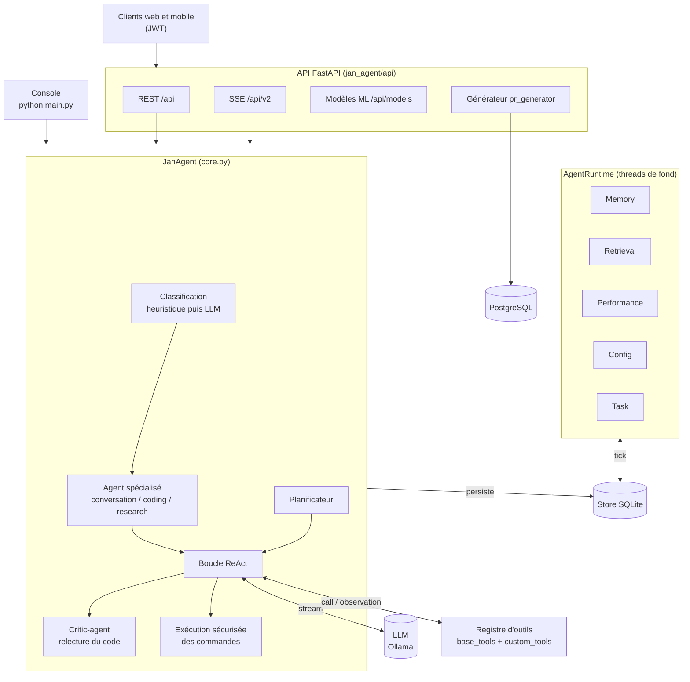

# DARCUS Agent

Agent IA autonome écrit en Python. Il combine une **boucle ReAct** pilotée par un LLM local (Ollama), des **agents spécialisés** (conversation, code, recherche, critique), une **mémoire persistante** entretenue par des agents de fond, et une **API FastAPI** (REST + SSE) protégée par JWT.

Il sait lire et écrire des fichiers, lancer des commandes shell filtrées, chercher sur le web et charger vos propres outils. Il embarque aussi un module de gestion de modèles scikit-learn.

> Documentation : [API](docs/API.md) · [schéma d'architecture](docs/architecture.html) (à ouvrir dans un navigateur).

## Sommaire

- [Fonctionnalités](#fonctionnalités)
- [Architecture](#architecture)
- [Démarrage rapide](#démarrage-rapide)
- [Configuration](#configuration)
- [Utilisation](#utilisation)
- [Ajouter un outil](#ajouter-un-outil)
- [Structure du dépôt](#structure-du-dépôt)
- [Tests](#tests)
- [Sécurité](#sécurité)

## Fonctionnalités

- **Boucle ReAct** : le LLM alterne réflexion (`<thought>`), appel d'outil (`<call>`) et réponse (`<response>`) jusqu'à la réponse finale.
- **Routage multi-agents** : chaque requête est classifiée (`conversation`, `coding` ou `research`) par une heuristique rapide, puis par le LLM si nécessaire. Chaque agent a son prompt, surchargeable dans `config.json`.
- **Agent critique** : le code généré est relu avant d'être renvoyé ; les défauts et failles de sécurité sont signalés.
- **Planification** : génération d'un plan d'étapes avant l'exécution.
- **Mémoire persistante** (SQLite) : conversations, résumés automatiques des longs échanges, recherche dans l'historique.
- **Exécution de commandes sécurisée** : commandes autorisées, mots interdits, auto-approbation configurable.
- **Outils extensibles** : outils intégrés, plus chargement dynamique depuis `custom_tools/`.
- **API temps réel** : REST, streaming SSE, authentification JWT.
- **Cycle de vie ML** : création, entraînement, versionnage, évaluation et prédiction de modèles scikit-learn.

## Architecture



**Parcours d'un message (mode API)**

1. Le client appelle `/api/v2/chat/send` avec son jeton JWT, vérifié avant tout traitement.
2. `JanAgent` classifie la requête et choisit l'agent spécialisé et son prompt.
3. La boucle ReAct appelle le LLM, qui répond ou demande un outil ; le registre exécute l'outil et renvoie l'observation.
4. Pour du code, le `critic-agent` relit la réponse finale.
5. La réponse est envoyée en flux (SSE) et l'échange est enregistré dans SQLite.
6. En parallèle, `Memory` résume les longues conversations et `Performance` publie ses métriques.

## Démarrage rapide

### Prérequis

- Python 3.10 ou plus
- [Ollama](https://ollama.com) en local, avec au moins un modèle : `ollama pull llama3.1`
- PostgreSQL, uniquement pour le module `pr_generator`

### Installation

```bash
git clone <url-du-depot> darcus-agent
cd darcus-agent
python3 -m venv .venv
source .venv/bin/activate
pip install -r requirements.txt
```

### Lancement

```bash
export JWT_SECRET="$(openssl rand -hex 32)"

python3 main.py          # mode console
python3 main.py --api    # serveur API sur http://localhost:8000
```

Le port de l'API se change avec la variable `PORT`.

## Configuration

Tout se règle dans [`config.json`](config.json) :

| Section | Contenu |
|---|---|
| `server` | URL du serveur LLM (`http://localhost:11434` par défaut), token, timeout, `keep_alive` |
| `model` | Modèle par défaut, modèle de la mémoire, température, `max_tokens`, `num_ctx`, mode de planification |
| `memory` | `threshold` : nombre de messages déclenchant un résumé ; `keep_last` : messages conservés intacts |
| `security` | `allowed_commands`, `forbidden_keywords`, `auto_approved_commands`, `max_retry_count` |
| `system_prompt` | Prompt système de l'agent |

Le module `pr_generator` se connecte à PostgreSQL via `pr_generator/data_config.json`.

Les valeurs livrées sont des **valeurs de développement local**. Ne committez jamais de vrais secrets.

### Variables d'environnement

| Variable | Rôle | Défaut |
|---|---|---|
| `JWT_SECRET` | Secret de signature des jetons. Il doit être identique à celui du service qui émet les jetons. | valeur de développement, à remplacer |
| `PORT` | Port de l'API | `8000` |

## Utilisation

### Console

```bash
python3 main.py
```

Vous dialoguez directement avec l'agent.

### API

> Documentation complète : [`docs/API.md`](docs/API.md) (authentification, streaming SSE, exemples `curl`, codes d'erreur).

Une fois le serveur lancé, la documentation OpenAPI interactive est sur `http://localhost:8000/docs`. Les routes ci-dessous exigent un jeton JWT (`Authorization: Bearer <jeton>`), sauf celles du générateur de données (`/api/generate`, `/api/task/{id}`, `/api/data/{projet}`, `/api/projects`) et `POST /api/models/{id}/predict`.

| Routes | Rôle |
|---|---|
| `GET/POST /api/conversations`, `DELETE /api/conversations/{id}` | Gérer les conversations |
| `GET /api/chat/{id}/history`, `POST /api/chat/{id}/reset`, `GET /api/chat/{id}/plan` | Historique, remise à zéro, plan courant |
| `GET /api/v2/chat/models`, `POST /api/v2/chat/send` | Modèles disponibles et envoi d'un message en streaming (SSE) |
| `GET /api/tasks` | Tâches en file |
| `GET/POST /api/config` | Lire et modifier la configuration |
| `GET /api/agent/status` | État des agents |
| `GET /api/security/config`, `POST /api/security/auto-approve` | Règles de sécurité |
| `/api/models/…` | Cycle de vie ML : `train`, `versions`, `evaluate`, `predict`, `benchmark`, `compare`, `history` |
| `POST /api/generate`, `GET /api/task/{id}`, `GET /api/data/{projet}`, `GET /api/projects` | Générateur de données |

## Ajouter un outil

Les outils se déclarent avec le décorateur `@tool(nom, description)` (voir [`jan_agent/tools/base_tools.py`](jan_agent/tools/base_tools.py)). Outils intégrés : `read_file`, `write_file`, `patch_file`, `list_directory`, `web_search`, `run_command`.

Pour ajouter les vôtres, créez un fichier Python dans [`custom_tools/`](custom_tools/) : ils sont chargés dynamiquement. Le fichier [`custom_tools/exemple.py`](custom_tools/exemple.py) sert de modèle.

## Structure du dépôt

```
.
├── main.py                 point d'entrée (console ou --api)
├── config.json             configuration
├── requirements.txt
├── docs/
│   ├── API.md              documentation de l'API
│   └── architecture.html   schéma d'architecture détaillé
├── jan_agent/
│   ├── core.py             JanAgent : classification, boucle ReAct, sécurité
│   ├── planner.py          génération de plans
│   ├── react_parser.py     lecture du format thought / call / response
│   ├── runtime.py          AgentRuntime : agents de fond
│   ├── database.py         persistance SQLite
│   ├── agents/             agents de fond et agents spécialisés
│   ├── tools/              registre d'outils et outils de base
│   └── api/                routes REST et SSE, schémas, JWT
├── custom_tools/           vos outils
├── ml_models/              cycle de vie des modèles scikit-learn (+ tests)
└── pr_generator/           générateur de données et tableau de bord Streamlit
```

## Tests

```bash
pytest
```

Les tests actuels couvrent le module `ml_models` (`ml_models/tests/`).

## Sécurité

- L'agent peut **exécuter des commandes shell**. Elles sont filtrées par `security.allowed_commands` et `security.forbidden_keywords`. Relisez ces listes avant tout usage hors de votre machine.
- N'exposez pas l'API sur un réseau non fiable sans HTTPS et sans `JWT_SECRET` propre.
- L'état local (`agent_memory.sqlite3`, `memory.json`, logs) est ignoré par git : il peut contenir vos conversations.
